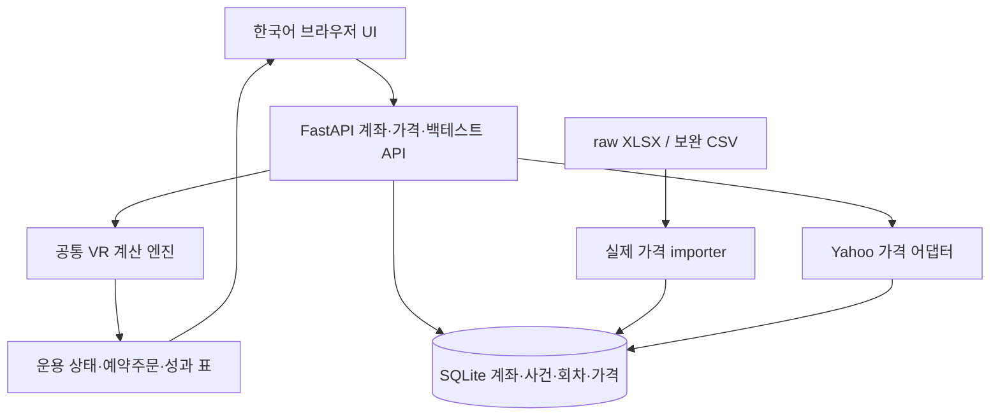
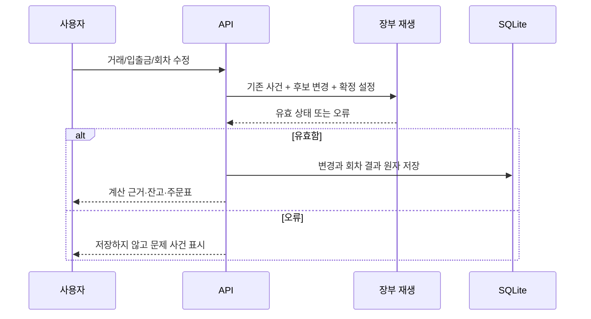
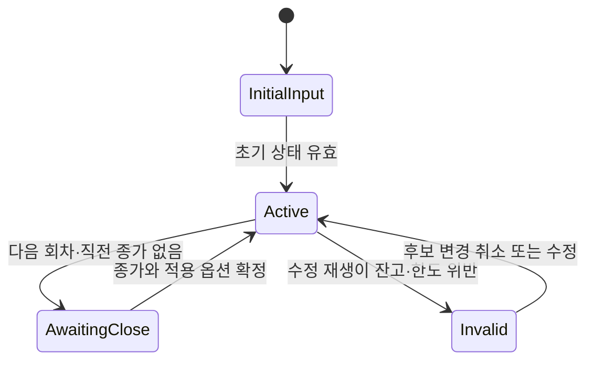
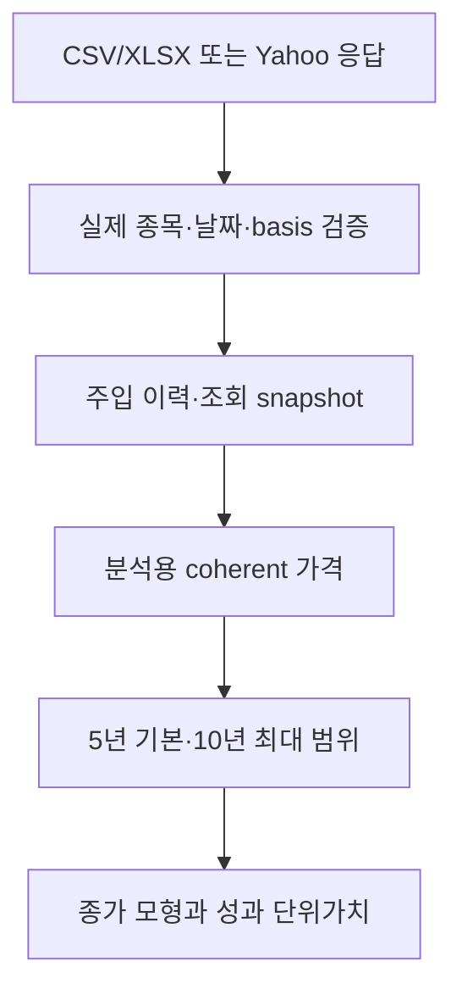
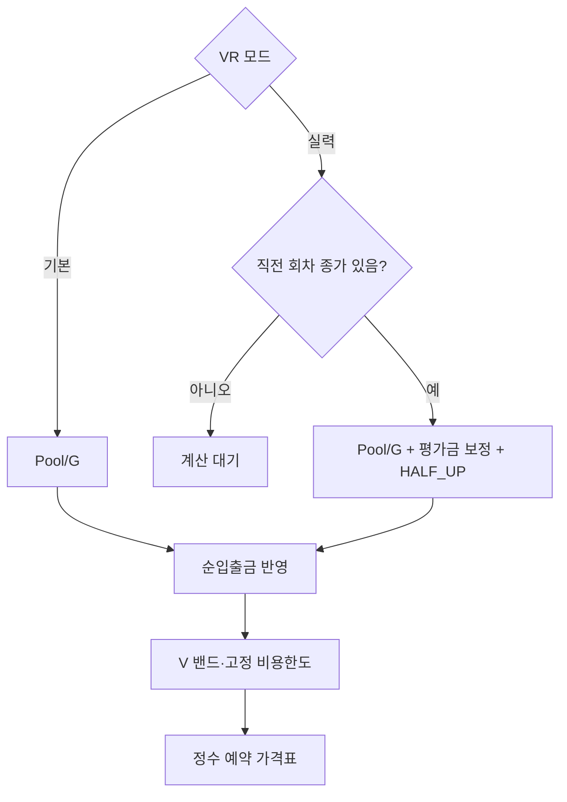

# Local VR Investment Service - Plan

## Goal Capsule

- **Objective:** 김승혁이 구글시트 없이 투자 장부를 저장하고, 기본 VR·실력 VR의 다음 회차와 예약주문을 계산하며, 같은 조건의 과거 성과를 비교할 수 있다.
- **Means:** 로컬 웹 서비스와 SQLite를 사용한다(KTD1).
- **Authority:** 사용자의 기능·배포 요청이 우선이며, Product Contract는 동작을, Planning Contract는 구현 선택을 정한다.
- **Execution profile:** 계획에 따라 구현하고 테스트한 뒤 변경 사항을 리뷰한다. 금액·상태 전이의 작은 독립 예제로 계산을 먼저 검증한다.
- **Finish:** 구현자는 사용자 지정 WSL 배포를 실행하고 GitHub에 기능 변경을 PR로 전달한다.
- **Stop conditions:** 원본 데이터 손상, 실제·합성 가격 혼합, 과거 확정 장부의 조용한 변경이 발견되면 해당 경로를 수정하기 전 배포하지 않는다.

---

## Product Contract

### Summary

운용 장부, 회차별 계산, 예약주문, 가격 자료, 백테스트를 하나의 한국어 웹 화면에서 제공한다.
기본 VR과 실력 VR은 공통 장부를 사용하고 V 갱신식을 선택한다.
인터넷에서 받은 가격은 로컬 DB에 저장해 다음 분석에서 재사용한다.

### Problem Frame

구글시트의 입력·복사와 종목별 파일 관리가 반복되고, 설정을 바꿨을 때 과거 계산과 실제 장부를 구별하기 어렵다.
추가 입금과 가격 조정 기준이 섞이면 운용 자금과 투자 성과를 잘못 읽을 수 있다.

### Requirements

**Portfolio operations**

- R1. 기본 VR과 REV2 실력 VR을 선택하며, 최초 V는 초기 주식평가금 또는 명시한 초기 V로 설정한다.
- R2. TQQQ·QLD·SOXL·UPRO를 기본 선택지로 제공하고, 유효한 추가 종목 코드를 저장하고 가격을 조회할 수 있다. 종목 통화를 기록하고 계좌·분석 화면을 그 통화로 표시한다.
- R3. 독립 운용계좌별 설정을 저장한다. 초기 총자금·배분·실제 초기 주수/Pool/V·G·밴드·비용률·호가단위·회차 길이·Pool 사용률·적립/인출액·시작일을 변경할 수 있다.
- R4. 실제 매수·매도·배당·비용·주식분할과 외부 순입출금을 저장하며, 시간순 재생에서 각 사건 직후 Pool·주수·매수한도가 유효해야 한다.
- R5. 미국 거래일 날짜로 회차를 구분하고, 실력식에 필요한 직전 회차 종가가 없으면 다음 V와 주문표를 계산 대기로 표시한다.
- R6. 확정 회차에는 적용 설정을 저장하며, 이후 기본 설정 변경이 과거 확정 회차를 바꾸지 않는다. 최초 거래 이후 ticker와 초기 잔고는 일반 옵션 변경에서 잠근다.
- R7. 예약주문은 정수 주수별 매수·매도가, 수수료 포함 누적 비용, 잔여 한도를 보여 주며 증권사에 자동 전송하지 않는다.

**Price data and analysis**

- R8. 사용자 지정 raw 자료의 실제 종목 가격을 SQLite에 주입하고 출처·조회 시각·가격 기준을 기록한다. 합성 가격은 실제 구간 보충에 사용하지 않는다.
- R9. 가격 조회 기간은 기본 5년, 최대 10년이며, 지원 종목에 데이터가 없으면 인터넷에서 받아 DB에 저장한다.
- R10. 가격 갱신 실패 시 기존 유효 자료를 유지하고 화면에 실패 원인과 기존 자료의 마지막 날짜를 보여 준다.
- R11. 백테스트는 설정과 외부 입출금을 반영한 일별 종가 모형을 제공한다. 일별 표·총자산/성과 그래프·Pool·매매·수익률·MDD와 계산 조건을 함께 표시한다.
- R12. 추가 입금은 적용할 회차 시작 사건으로 저장해 Pool과 V에 각 한 번 반영한다. 회차 도중 입력하면 다음 회차 적용일을 보여 주며, 정기 예정 입금과 실제 입력을 중복 합산하지 않는다.
- R13. 수정종가 모형과 실제 운용 주수를 화면에서 구별하고, 수정종가 모형에는 배당 현금을 다시 더하지 않는다.
- R14. 외부 입출금이 있는 성과는 입출금을 제거한 시간가중 수익률과 그 성과 곡선의 MDD를 사용하며, 순투입금·총자산·평가손익을 별도로 표시한다.

**Persistence and delivery**

- R15. 계좌·설정·사건·회차·가격이 서버 재시작 이후에도 유지된다.
- R16. 사용자 지정 GitHub 저장소에 구현하고, 지정 WSL hobby 디렉터리의 신규 kauri_vr_invest_service 디렉터리에 배포한다.
- R17. 서비스는 localhost에서 사용하며, 원본 가격 파일·계좌 DB·개인 장부·토큰은 Git에 포함하지 않는다.

### Acceptance Examples

- AE1. **Covers R1, R3, R5.** 총자금 15,000·배분 50%·초기가 100·비용률 0.0005이면 최초 74주, Pool 7,596.30, V 7,400이다. G=10이고 직전 회차 종가=80이면 다음 실력 V는 7,925.62다.
- AE2. **Covers R4, R6, R12.** 새 회차에 5,000을 입금하면 현금과 V에 각 한 번 반영된다. 사건 삭제 또는 수정은 영향을 받는 회차를 명시적으로 재계산하고, 실패하면 수정 전 장부를 보존한다.
- AE3. **Covers R8, R10, R13.** 실제 TQQQ 시트와 합성 3×NDX 시트가 함께 있는 XLSX를 주입하면 실제 TQQQ만 사용한다. Yahoo 실패로 합성 가격을 실제 빈 구간에 채우지 않는다.
- AE4. **Covers R11, R14.** 가격이 변하지 않는 모형에 5,000을 입금하고 비용이 0이면 입금 때문에 수익률과 MDD가 변하지 않는다.

### Scope Boundaries

자동 증권 주문, 증권사 계좌 로그인, 다중 사용자 인증, 원격 공개 서비스는 포함하지 않는다.
장중 지정가 체결·세금·환율·이자 예측은 이번 종가 모형에 포함하지 않는다.
분할/배당을 완전 재현하는 실제 주수 백테스트는 후속 작업으로 남기며 R13의 수정종가 모형을 사용한다.
예약 가격표와 종가 백테스트의 체결 결과가 같다고 주장하지 않는다.
분산 큐·별도 프론트 빌드·자동 가격 갱신 스케줄은 개인용 규모에서 현재 필요가 없어 구축하지 않는다.

---

## Planning Contract

### Assumptions

- 이 서비스는 김승혁의 단일 로컬 사용을 대상으로 한다.
- 기본값은 15,000 USD·초기 주식 50%·G=10·밴드 ±15%·비용 0.05%·회차 14일·고정 Pool 사용률 50%·미국 시작일 2026-10-02다.
- Pool 사용률 자동 모드는 UI의 명시적 선택으로 제공할 수 있으며 기본값을 자동 75%로 바꾸지 않는다.
- 기존 시트의 실제 초기 상태 덮어쓰기는 이관 입력에 필요하다. 원본 시트에서 계좌 정보를 자동 추출하지 않는다.

### Key Technical Decisions

- KTD1. **FastAPI + SQLite + vanilla HTML/CSS/JS.** 계좌와 가격을 한 로컬 프로세스에서 관리하고 프론트 빌드 없이 배포한다. 별도 React 서버·PostgreSQL·작업 큐는 규모에 비해 운용 단계가 늘어난다. Governs R3, R15, R16.
- KTD2. **순수 계산 엔진을 운용과 백테스트에서 공유.** 기본식은 `V_prev + Pool_prev/G + flow`, 실력식은 `ROUND(V_prev + Pool_prev/G + (E_prev-V_prev)/(2*sqrt(G)), 2) + flow`다. 실력식의 반올림은 HALF_UP으로 명시하고 입금 전 Pool을 사용한다. 기본식에 임의의 cents 반올림을 추가하지 않는다. Governs R1, R5, R12.
- KTD3. **사건 장부와 회차 설정 스냅샷.** 거래·외부 입출금은 ID와 날짜를 갖는 사건이며, 계좌 수정은 유효성 검사와 재생을 같은 트랜잭션에 넣는다. revision 불일치는 충돌로 거절해 오래 열린 화면의 덮어쓰기를 막는다. 과거 회차의 변경은 명시적인 수정 동작으로만 이루어진다. 분할 사건은 실제 주수만 비율로 조정하고 Pool과 V를 보존한다. Governs R4, R6, R15.
- KTD4. **고정 회차 매수한도.** 회차 시작 한도는 `(입금 전 Pool + 이번 flow) × usage`이며, 같은 회차 매도금·배당으로 한도를 다시 늘리지 않는다. 현재 현금과 잔여 한도 중 작은 금액으로 매수를 제한한다. Governs R4, R7, R12.
- KTD5. **실제 가격 provenance와 일관된 공급자 snapshot.** 원본 XLSX는 종목과 같은 이름의 실제 시트만 읽는다. 날짜·종목·공급자/basis를 식별하고 원본 주입 이력을 저장한다. QLD/TQQQ의 오래된 Adj Close와 최신 값의 기준 차이를 피하려고 분석용 최대 기간을 한 번의 Yahoo snapshot으로 다시 확보한다. 원본 주입 이력은 보존한다. Governs R8, R9, R13.
- KTD6. **인터넷 조회는 교체 가능한 Yahoo 어댑터.** ticker를 검증하고 고정 공급자 호스트만 호출한다. 공급자 exchange timezone의 날짜·통화/양수 유한 가격/정렬/응답 구조를 검증한 뒤 원자적으로 저장한다. 진행 중인 당일 봉은 확정 회차 종가에 사용하지 않는다. Yahoo chart는 공식 안정성 계약이 없는 경로이므로 HTTP 오류·빈 응답에서 DB를 지우지 않는다. Governs R2, R9, R10.
- KTD7. **입출금을 제거한 성과.** 입출금은 새 회차 거래 전 발생하며, 성과 단위가치는 당시 거래 전 평가액으로 신규 단위를 발행/상환한다. 이후 시장변화와 비용만 수익률과 MDD에 반영한다. 전액 인출 또는 잔액 부족 인출은 모형을 종료하거나 오류로 표시하고 0으로 나누지 않는다. Governs R11, R14.
- KTD8. **조정종가 종가 모형.** 백테스트 시작일은 요청 범위의 첫 실제 거래일이다. 새 회차는 첫 실제 거래일에 한 번 갱신하고 직전 실제 거래일 종가로 E_prev를 계산한다. 미래 값과 장중 OHLC를 체결 판단에 사용하지 않는다. Governs R5, R11, R13.
- KTD9. **SQLite는 WSL Linux 파일 시스템에 저장.** 짧은 트랜잭션·foreign keys·busy timeout·schema version을 적용하고 공급자 네트워크 응답을 기다리는 동안 write lock을 잡지 않는다. 초기에는 DELETE journal을 사용한다. WAL은 런타임 SQLite가 공식 WAL-reset 버그 수정판인지 확인한 뒤에만 선택한다. Governs R10, R15.
- KTD10. **로컬 쓰기 경계와 재배포 보존.** loopback bind, localhost Host 검증, 동일 origin 쓰기 검증과 JSON/custom header를 사용한다. DB와 가상환경은 소스 동기화에서 제외하고 배포 직전 SQLite backup API로 백업한다. Governs R15, R16, R17.

### High-Level Technical Design

데이터 엔터티는 계좌·설정·사건·회차·가격·주입 이력이다.
계좌 API는 생성/선택/설정, 사건 API는 추가/수정/삭제, 회차 API는 종가·옵션 확정, 가격 API는 목록/조회/동기화, 백테스트 API는 조건 실행으로 나눈다.
수정 API는 계산 오류를 성공 응답으로 감추지 않고 실패 상태와 사용자 수정 위치를 반환한다.

### Risks and Dependencies

- Yahoo 접근 차단이나 schema 변경은 R10으로 처리한다. 공급자 최신성은 마지막 미국 거래일 날짜와 조회 시각을 함께 표시한다.
- Python 3.14 호환 FastAPI/Pydantic 버전을 설치하고 정확한 의존성을 고정한다. Pydantic 2.12 이상이 3.14 지원의 근거다.
- 장부 통화 환산·세금은 실제 브로커 기록에서 확인해야 한다. 이번 실제 장부에는 사용자가 실제 주수·배당·분할 사건을 입력한다.
- WSL systemd 사용자 서비스는 WSL 시작 이후 실행된다. Windows 부팅 때 WSL을 자동으로 시작하거나 WSL 종료를 막는 기능으로 설명하지 않는다.
- raw import는 원본을 변경하지 않는다. 오래된 파일·중복 날짜·단일 malformed 행 처리 결과를 주입 보고서에 남긴다.

### Sources and Research

원본 REV2 H8 수식과 최근 실력 시트의 최종 override가 KTD2의 근거다.
기존 분석 함수는 실력식 cents 반올림이 없으므로 그대로 복사하지 않는다.
공개 fixture는 작은 입력/기대값으로 구성하고 원본 계좌 파일을 저장소에 넣지 않는다.

- [FastAPI testing](https://fastapi.tiangolo.com/tutorial/testing/)은 API와 순수 엔진 검증 분리를 뒷받침한다.
- [Pydantic v2.12](https://pydantic.dev/articles/pydantic-v2-12-release)는 Python 3.14 의존성 선택의 근거다.
- [SQLite WAL-reset bug](https://sqlite.org/wal.html#walreset)는 KTD9의 journal 선택을 제한한다.
- [Python SQLite backup](https://docs.python.org/3/library/sqlite3.html#sqlite3.Connection.backup)은 KTD10의 재배포 백업 방식 근거다.
- [WSL systemd](https://learn.microsoft.com/en-us/windows/wsl/systemd)는 systemd 사용자 서비스 배포의 근거다.

---

## Implementation Units

### U1. Repository and service foundation

**Goal:** 재현 가능한 서비스와 검증 진입점을 준비한다.
**Requirements:** R16, R17.
**Dependencies:** 없음.
**Files:** `pyproject.toml`, `requirements.txt`, `.gitignore`, `README.md`, `app/__init__.py`, `app/main.py`, `tests/test_health.py`, `.github/workflows/tests.yml`.
**Approach:** KTD1·KTD10에 따라 health API·정적 파일 제공·환경설정 경계를 구성한다. 빈 저장소의 문서 bootstrap을 main 기준점으로 두고 기능 변경은 별도 브랜치 PR로 전달한다.
**Test scenarios:**
1. health API가 버전과 DB 준비 상태를 반환한다.
2. 외부 Host 또는 origin의 쓰기 요청이 거부되고 정상 localhost 요청은 동작한다.
**Verification:** 새로운 가상환경 설치와 API smoke가 통과하고 runtime DB가 Git에서 제외된다.

### U2. Shared VR engine

**Goal:** V·밴드·비용한도·정수 주문·종가 매매를 한 계산 엔진으로 제공한다.
**Requirements:** R1, R3, R5, R7, R12, R13; AE1.
**Dependencies:** U1.
**Files:** `app/engine.py`, `app/schemas.py`, `tests/test_engine.py`.
**Approach:** KTD2·KTD4·KTD8의 계산을 I/O 없는 함수로 구현한다. 실제 운용 입력과 수정종가 모형 입력의 basis를 결과에 붙인다.
**Execution note:** 기존 시트의 독립 기대값과 반올림 경계값을 먼저 검증한다.
**Test scenarios:**
1. Covers AE1. 74주·Pool 7,596.30·V 7,400과 다음 실력 V 7,925.62가 일치한다.
2. 종가 120이면 V 8,393.64이고 같은 입력에 순입금 100을 더하면 8,493.64다.
3. 직전 종가 누락 시 실력식은 계산 대기지만 기본식은 갱신된다.
4. 정수 매수 내림·매도 올림, 호가 rounding, 비용 포함 누적 한도가 경계에서 지켜진다.
5. G≤0·음수 잔고·0 이하 V·부족한 인출은 명시 오류를 반환한다.
**Verification:** 엔진 결과에 초기 상태, Pool/G, 실력 보정, flow, 적용 V의 근거가 포함된다.

### U3. SQLite prices and import/sync

**Goal:** 원본 실제 가격과 새 가격을 감사 가능한 DB 자료로 관리한다.
**Requirements:** R2, R8, R9, R10, R15; AE3.
**Dependencies:** U1.
**Files:** `app/db.py`, `app/prices.py`, `app/importer.py`, `app/cli.py`, `tests/test_prices.py`, `tests/test_importer.py`, `tests/fixtures/prices.csv`.
**Approach:** KTD5·KTD6·KTD9에 따라 schema version과 provenance를 저장한다. XLSX 실제 시트와 보완 CSV를 CLI로 주입하고 웹에서 ticker sync를 수행한다.
**Test scenarios:**
1. Covers AE3. 실제 ticker 시트만 가져오며 합성·환율 시트를 제외한다.
2. 같은 파일 재주입은 중복 가격을 만들지 않고 보고서를 반환한다.
3. 날짜 오름차순·유한 양수 가격 검사를 통과한 행만 저장한다.
4. Yahoo 401/403/429·빈 응답·잘못된 JSON은 기존 coherent 가격을 유지한다.
5. 요청 5년은 해당 범위를 반환하고 10년 초과는 거부한다.
6. 최신 snapshot 성공 뒤 겹치는 모든 조정종가 기준이 같고 raw 주입 이력이 남는다.
**Verification:** 기본 네 종목과 원본 주입 결과의 실제 날짜 범위·행 수·출처를 읽어 확인한다.

### U4. Persistent portfolios and chronological ledger

**Goal:** 실제 입력을 저장하고 회차별 상태를 재계산한다.
**Requirements:** R3, R4, R5, R6, R12, R15; AE2.
**Dependencies:** U2, U3.
**Files:** `app/portfolios.py`, `app/main.py`, `tests/test_portfolios.py`, `tests/test_api.py`.
**Approach:** KTD3·KTD4를 구현한다. 회차 확정값과 미래 기본 설정을 분리하고, 입출금은 단일 사건 소유권으로 중복 적용을 막는다.
**Test scenarios:**
1. Covers AE2. 5,000 입금이 Pool과 V에 각 한 번 적용되고 새 비용한도에 반영된다.
2. 같은 회차 매도/배당으로 Pool은 늘지만 원래 매수한도는 늘지 않는다.
3. 미래 매도금으로 과거 부족한 매수를 정당화할 수 없다.
4. 설정 변경 후 과거 확정 회차 값이 유지된다.
5. 사건 수정·삭제가 후속 회차를 재생하며 오류에서 전체 저장을 rollback한다.
6. 서버 재생성 이후 계좌·사건·회차가 같은 결과를 반환한다.
7. 2:1 분할에서 주수는 두 배, Pool과 V는 불변이며 분할 후 가격이 반이면 자산이 보존된다.
8. 정기 예정 입금이 있는 회차에 실제 순입금을 입력하면 실제 값 한 번만 적용하고 stale revision 수정은 거절한다.
**Verification:** 입력/수정/새로고침을 거쳐 운용 상태와 예약주문이 일치한다.

### U5. Backtest and flow-adjusted performance

**Goal:** 같은 가격·설정으로 기본/실력 성과를 비교한다.
**Requirements:** R9, R11, R13, R14; AE4.
**Dependencies:** U2, U3.
**Files:** `app/backtest.py`, `app/main.py`, `tests/test_backtest.py`.
**Approach:** KTD7·KTD8을 사용하고 실제 가격 부족·요청 시작일 이전 상장·마지막 미완료 거래일을 결과 메타데이터에 명시한다. 일별 결과는 해당 입력과 공급자 snapshot을 참조한다.
**Test scenarios:**
1. Covers AE4. 0비용·고정 가격·5,000 입금에서 TWR와 MDD가 0이다.
2. 주말 시작일이 첫 실제 거래일로 이동하고 회차 경계가 14달력일이다.
3. 미래 가격을 바꿔도 과거 일별 상태가 바뀌지 않는다.
4. 가격 공백·상장 이전 요청은 사용된 실제 범위와 부족 상태를 표시한다.
5. 기본/실력 동일 입력에서 계산식 차이만 적용되고 정수 주수·Pool이 음수가 아니다.
6. 원본 보완 데이터의 2026 QLD/TQQQ 무입금 기대값을 비용·basis 조건이 같을 때 재현한다.
**Verification:** 총자산/순투입금/손익과 TWR/MDD의 의미가 분리되어 일별 표와 요약이 일치한다.

### U6. Korean operations and analysis UI

**Goal:** 웹에서 설정·장부·주문·데이터·백테스트를 직접 사용할 수 있다.
**Requirements:** R1–R14.
**Dependencies:** U4, U5.
**Files:** `app/static/index.html`, `app/static/app.js`, `app/static/styles.css`, `tests/browser.spec.mjs`, `package.json`.
**Approach:** 계좌 선택과 운용/백테스트/가격 데이터 화면을 제공한다. 입력 단위·기본값·현재 적용 설정을 표시하고 결과 표 및 SVG/canvas 차트를 함께 제공한다. 오류는 해당 폼 옆에 표시한다.
**Test scenarios:**
1. 기본 네 ticker와 추가 ticker로 계좌를 만들고 새로고침 후 선택/입력이 유지된다.
2. 기본/실력 전환과 G/밴드/초기비중 변경이 결과에 반영된다.
3. 직전 종가 미입력 시 대기 이유와 필요한 입력 위치가 보인다.
4. 5,000 입금과 거래 수정이 장부·주문에 반영되고 오류 입력은 저장되지 않는다.
5. sync 성공/실패와 마지막 가격 날짜가 구별된다.
6. 백테스트 차트·표·수익률·MDD가 읽히고 모바일 폭에서 입력과 결과를 사용할 수 있다.
**Verification:** 브라우저에서 요청된 작업 흐름을 끝까지 실행하고 console 오류가 없다.

### U7. WSL deployment and project knowledge

**Goal:** 재시작 가능한 로컬 서비스를 지정 폴더에서 운영한다.
**Requirements:** R15, R16, R17.
**Dependencies:** U6.
**Files:** `scripts/deploy_wsl.sh`, `deploy/kauri-vr.service`, `README.md`, `docs/solutions/vr-price-basis-and-ledger.md`, `tests/test_deployment.py`.
**Approach:** 사용자 지정 WSL 디렉터리에 source·venv·runtime DB를 배치하고 linger가 켜진 kauri의 systemd 사용자 unit으로 실행한다. KTD10의 백업/보존과 원본 import를 수행하고 알려진 SQLite 버전을 기록한다.
**Execution note:** 배포는 설치·재시작·영속성 smoke로 검증한다.
**Test scenarios:**
1. 서비스 health와 Windows localhost 접근이 성공한다.
2. 서비스 재시작과 재배포 후 DB·계좌·가격 행 수가 보존된다.
3. 백업 DB를 별도 임시 위치에서 열어 schema와 계좌를 읽을 수 있다.
**Verification:** systemd 상태, 실제 접속 URL, 데이터 주입 요약과 검증 결과를 전달한다.

---

## Verification Contract

| Gate | Units | Completion signal |
|---|---|---|
| Python tests | U1–U5 | 엔진·DB·import·sync 실패·계좌 재생·backtest 테스트 통과 |
| Browser tests | U6 | 주요 폼과 장부 입력·가격 sync·기본/실력 비교 흐름 통과 |
| Actual raw import | U3 | 원본별 actual 시트/CSV 행 수·날짜·제외 시트 보고서 확인 |
| Runtime smoke | U7 | WSL user service active·health·Windows localhost·재시작 영속성 확인 |
| Change review | 전체 | 최종 diff의 P0/P1 해결·P2 판단과 계산/데이터 경계 검토 기록 |
| Privacy scan | 전체 | raw 파일·DB·계좌·토큰이 Git 변경에 없음 |

정확한 테스트 명령은 U1에서 정한 README와 CI를 동일하게 사용한다.
외부 인터넷 호출을 매번 요구하는 테스트 대신 공급자 응답 fixture를 사용하고 실제 sync smoke를 별도로 수행한다.
서로 다른 조정 시점의 Yahoo 가격이므로 고정 과거 숫자의 불일치는 snapshot 차이를 먼저 확인한다.

---

## Definition of Done

- R1–R17의 동작이 구현되고 각 U-ID의 검증 신호가 충족된다.
- 실제 원본 가격과 인터넷 보완 자료가 DB에 들어 있고 합성 값은 실제 분석에 섞이지 않는다.
- 브라우저에서 계좌 작성·거래/입출금·회차 종가·주문 확인·백테스트를 사용할 수 있다.
- 배포된 서비스 재시작 이후 저장 데이터가 유지된다.
- 테스트 후 최종 변경 리뷰가 완료되고, 원인과 판단이 필요한 프로젝트 지식이 저장소에 남는다.
- 중간 실험·폐기 코드·개인 자료를 diff에서 제거하고 GitHub 기능 PR과 접속 방법을 전달한다.
